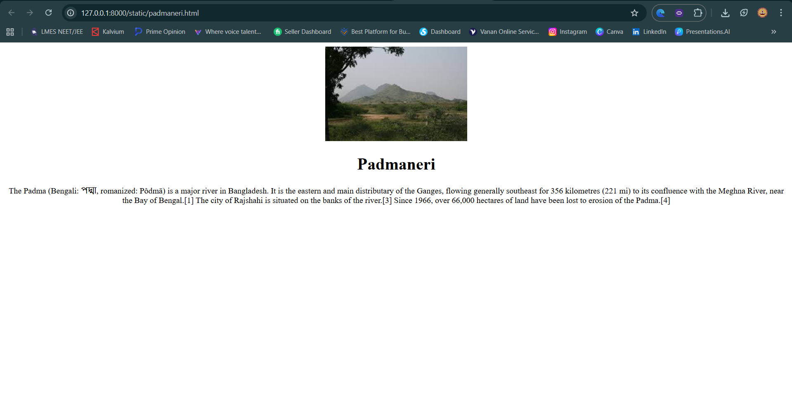
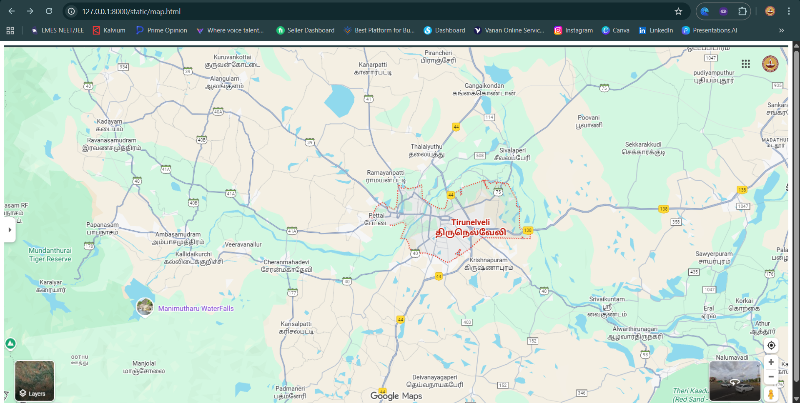
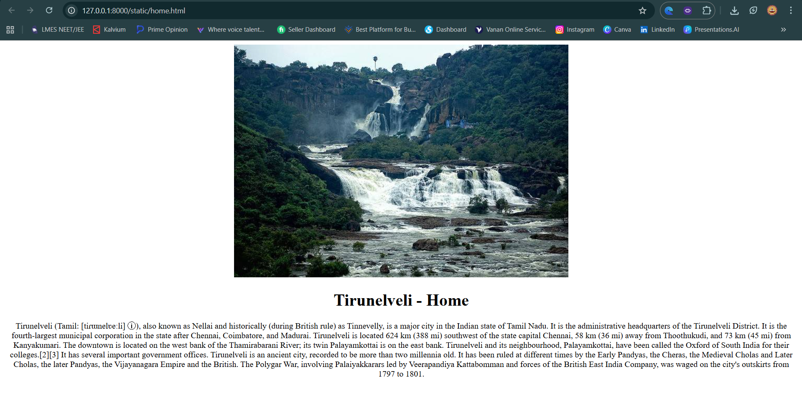
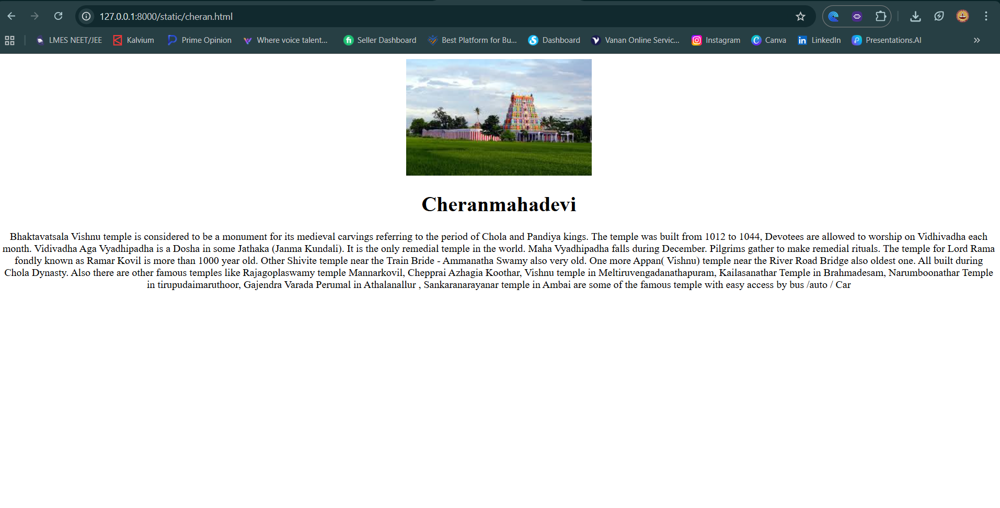
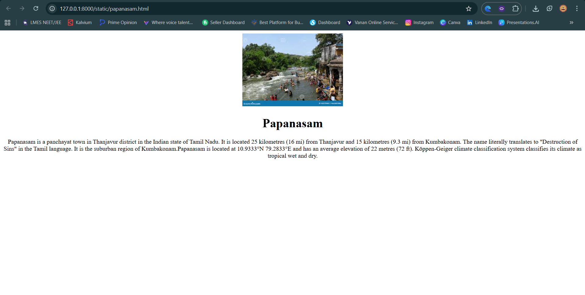
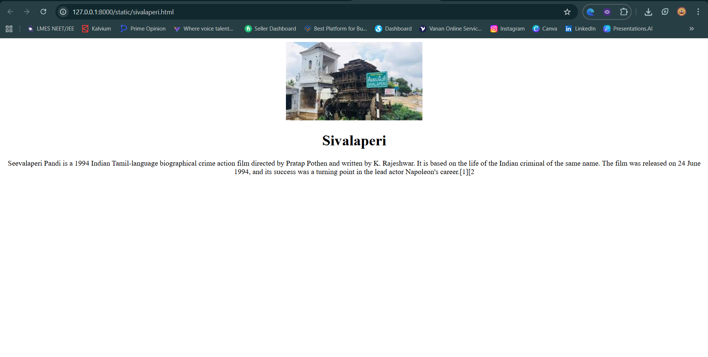

# Ex04 Places Around Me
## Date: 15-102025

## AIM
To develop a website to display details about the places around my house.

## DESIGN STEPS

### STEP 1
Create a Django admin interface.

### STEP 2
Download your city map from Google.

### STEP 3
Using ```<map>``` tag name the map.

### STEP 4
Create clickable regions in the image using ```<area>``` tag.

### STEP 5
Write HTML programs for all the regions identified.

### STEP 6
Execute the programs and publish them.

## CODE
```
map.html:
<!DOCTYPE html>
<html lang="en">
<head>
    <meta charset="UTF-8">
    <meta name="viewport" content="width=device-width, initial-scale=1.0">
    <title>Document</title>
</head>
<body>
    <style>
        img {
            max-width: 100%;
            height: 700px;
        }   
    </style>
    

    <map name="tiru">
        <area target="_blank" alt="home" title="home" href="home.html" coords="1096,393,840,234" shape="rect">
        <area shape="rect" coords="777,557,613,496" target="_blank" href="cheran.html" alt="">
        <area shape="circle" coords="200,200,100" target="_blank" href="sivalaperi.html" alt="">
        <area shape="circle" coords="408,550,490" target="_blank" href="papanasam.html" alt="">
        <area shape="circle" coords="600,320,660" target="_blank" href="padmaneri.html" alt="">
    </map>

</body>
</html>

home.html:
<!DOCTYPE html>
<html lang="en">
<head>
    <meta charset="UTF-8">
    <meta name="viewport" content="width=device-width, initial-scale=1.0">
    <title>Document</title>
</head>
<body align="center">
    
    <h1>Tirunelveli - Home</h1>
    <p>Tirunelveli (Tamil: [tiɾɯnelʋeːli] ⓘ), also known as Nellai and historically (during British rule) as Tinnevelly, is a major city in the Indian state of Tamil Nadu. It is the administrative headquarters of the Tirunelveli District. It is the fourth-largest municipal corporation in the state after Chennai, Coimbatore, and Madurai. Tirunelveli is located 624 km (388 mi) southwest of the state capital Chennai, 58 km (36 mi) away from Thoothukudi, and 73 km (45 mi) from Kanyakumari. The downtown is located on the west bank of the Thamirabarani River; its twin Palayamkottai is on the east bank. Tirunelveli and its neighbourhood, Palayamkottai, have been called the Oxford of South India for their colleges.[2][3] It has several important government offices.

Tirunelveli is an ancient city, recorded to be more than two millennia old. It has been ruled at different times by the Early Pandyas, the Cheras, the Medieval Cholas and Later Cholas, the later Pandyas, the Vijayanagara Empire and the British. The Polygar War, involving Palaiyakkarars led by Veerapandiya Kattabomman and forces of the British East India Company, was waged on the city's outskirts from 1797 to 1801.</p>
</body>
</html>

cheran.html:
<!DOCTYPE html>
<html lang="en">
<head>
    <meta charset="UTF-8">
    <meta name="viewport" content="width=device-width, initial-scale=1.0">
    <title>Document</title>
</head>
<body align="center">
    
    <h1>Cheranmahadevi</h1>
    <p>Bhaktavatsala Vishnu temple is considered to be a monument for its medieval carvings referring to the period of Chola and Pandiya kings. The temple was built from 1012 to 1044, Devotees are allowed to worship on Vidhivadha each month. Vidivadha Aga Vyadhipadha is a Dosha in some Jathaka (Janma Kundali). It is the only remedial temple in the world. Maha Vyadhipadha falls during December. Pilgrims gather to make remedial rituals.

The temple for Lord Rama fondly known as Ramar Kovil is more than 1000 year old. Other Shivite temple near the Train Bride - Ammanatha Swamy also very old. One more Appan( Vishnu) temple near the River Road Bridge also oldest one. All built during Chola Dynasty. Also there are other famous temples like Rajagoplaswamy temple Mannarkovil, Chepprai Azhagia Koothar, Vishnu temple in Meltiruvengadanathapuram, Kailasanathar Temple in Brahmadesam, Narumboonathar Temple in tirupudaimaruthoor, Gajendra Varada Perumal in Athalanallur , Sankaranarayanar temple in Ambai are some of the famous temple with easy access by bus /auto / Car</p>
</body>
</html>

padmaneri.html:
<!DOCTYPE html>
<html lang="en">
<head>
    <meta charset="UTF-8">
    <meta name="viewport" content="width=device-width, initial-scale=1.0">
    <title>Document</title>
</head>
<body align="center">
    
    <h1>Padmaneri</h1>
    <p>The Padma (Bengali: পদ্মা, romanized: Pôdmā) is a major river in Bangladesh. It is the eastern and main distributary of the Ganges, flowing generally southeast for 356 kilometres (221 mi) to its confluence with the Meghna River, near the Bay of Bengal.[1] The city of Rajshahi is situated on the banks of the river.[3] Since 1966, over 66,000 hectares of land have been lost to erosion of the Padma.[4]</p>
</body>
</html>

papanasam.html:
<!DOCTYPE html>
<html lang="en">
<head>
    <meta charset="UTF-8">
    <meta name="viewport" content="width=device-width, initial-scale=1.0">
    <title>Document</title>
</head>
<body align="center">
    
    <h1>Papanasam</h1>
    <p>Papanasam is a panchayat town in Thanjavur district in the Indian state of Tamil Nadu. It is located 25 kilometres (16 mi) from Thanjavur and 15 kilometres (9.3 mi) from Kumbakonam. The name literally translates to "Destruction of Sins" in the Tamil language. It is the suburban region of Kumbakonam.Papanasam is located at 10.9333°N 79.2833°E and has an average elevation of 22 metres (72 ft). Köppen-Geiger climate classification system classifies its climate as tropical wet and dry.</p>
</body>
</html>

sivalaperi.html:
<!DOCTYPE html>
<html lang="en">
<head>
    <meta charset="UTF-8">
    <meta name="viewport" content="width=device-width, initial-scale=1.0">
    <title>Document</title>
</head>
<body align="center">
    
    <h1>Sivalaperi</h1>
    <p>Seevalaperi Pandi is a 1994 Indian Tamil-language biographical crime action film directed by Pratap Pothen and written by K. Rajeshwar. It is based on the life of the Indian criminal of the same name. The film was released on 24 June 1994, and its success was a turning point in the lead actor Napoleon's career.[1][2</p>
</body>
</html>

```

## OUTPUT
 
 
 
 
 


## RESULT
The program for implementing image maps using HTML is executed successfully.
